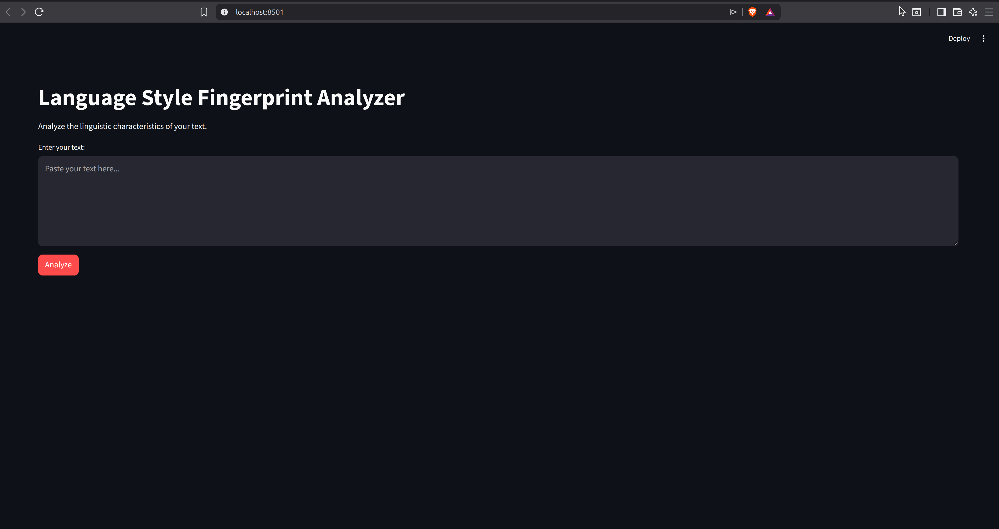
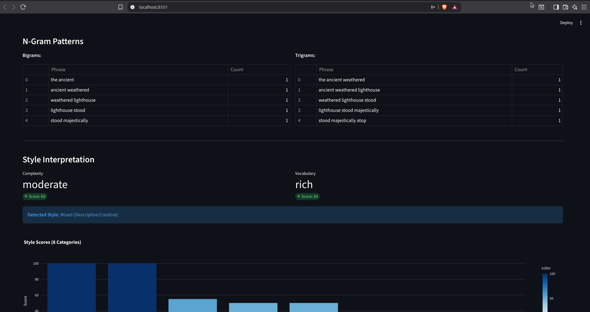

# Language Style Fingerprint Analyzer

A Natural Language Processing tool that analyzes written text and generates a linguistic fingerprint by extracting measurable stylistic features.

## Problem Statement

There is a lack of simple tools that automatically analyze and quantify the stylistic characteristics of written text. As a result, it is difficult to objectively evaluate writing complexity and linguistic patterns. This system applies NLP techniques to automatically extract stylistic features from text and generate a measurable linguistic profile.

## Features

- **Basic Statistics** - Sentence count, word count, average sentence length, variance
- **Vocabulary Analysis** - Lexical diversity, stopword ratio, top words
- **Part-of-Speech Distribution** - POS tagging with visual pie chart
- **N-Gram Patterns** - Bigram and trigram extraction
- **Style Interpretation** - 8 writing style categories with scoring

### Writing Styles Detected

| Style | Description |
|-------|-------------|
| Academic | Formal, technical, long sentences, noun-heavy |
| Conversational | Informal, short sentences, high stopword ratio |
| Descriptive | Rich in adjectives and adverbs |
| Narrative | Story-telling, verb-heavy, pronoun usage |
| Technical | Jargon-heavy, low stopword ratio, specific terminology |
| Persuasive | Action-oriented, imperative mood indicators |
| Journalistic | Medium length, balanced POS, factual tone |
| Creative | High lexical diversity, varied sentence lengths |

### Edge Case Handling

- **Insufficient Text** (< 10 words): Returns error message
- **Low Confidence** (10-30 words): Shows warning, results may be unreliable
- **Mixed Styles**: Detects when multiple styles score similarly
- **Varied Styles**: Identifies texts with no dominant pattern

## Tech Stack

- **Python 3.11**
- **NLTK** - Tokenization, n-grams, stopwords
- **spaCy** - Part-of-speech tagging
- **Streamlit** - Web interface
- **Plotly** - Interactive visualizations
- **UV** - Package management

## Installation

1. Clone the repository:
```bash
git clone <repository-url>
cd Language-Style-Analyser
```

2. Create virtual environment and install dependencies:
```bash
uv venv
source .venv/bin/activate
uv sync
```

3. Download required NLP models:
```bash
python -c "import nltk; nltk.download('punkt'); nltk.download('punkt_tab'); nltk.download('stopwords')"
python -m spacy download en_core_web_sm
```

4. Run the application:
```bash
streamlit run app.py
```

## Application Walkthrough

### 1. Home Screen

The landing page provides a clean interface for text analysis.



### 2. Text Input

Enter or paste the text you want to analyze in the text area.


### 3. Basic Statistics

View fundamental metrics about your text including sentence count, word count, average sentence length, and length variance.


### 4. Vocabulary Analysis

Examine lexical diversity, stopword ratio, and the most frequently used words in your text.


### 5. Part-of-Speech Distribution

Visualize the grammatical composition of your text with an interactive pie chart showing the distribution of nouns, verbs, adjectives, and other parts of speech.


### 6. N-Gram Patterns

Discover common phrase patterns through bigram (2-word) and trigram (3-word) analysis.



### 7. Style Interpretation

Get a comprehensive style assessment including complexity rating, vocabulary assessment, and scores across 8 writing style categories.


## Project Structure

```
Language-Style-Analyser/
├── app.py                      # Streamlit web application
├── core/
│   ├── __init__.py
│   ├── tokeniser.py            # Sentence and word tokenization
│   ├── vocabulary.py           # Lexical diversity analysis
│   ├── pos_analyser.py         # Part-of-speech tagging
│   ├── ngram_analyser.py       # Bigram and trigram extraction
│   └── style_interpretor.py    # Writing style classification
├── utilities/
│   ├── __init__.py
│   └── text_cleaner.py         # Text preprocessing
├── images/                     # Application screenshots
├── TEST_CASES.md               # Demo test cases
├── pyproject.toml              # Project dependencies
└── README.md
```

## Test Cases

See [TEST_CASES.md](TEST_CASES.md) for sample texts demonstrating each writing style and edge case.

## License

MIT License - See [LICENSE](LICENSE) for details.

## Author

Jamespeter Murithi
