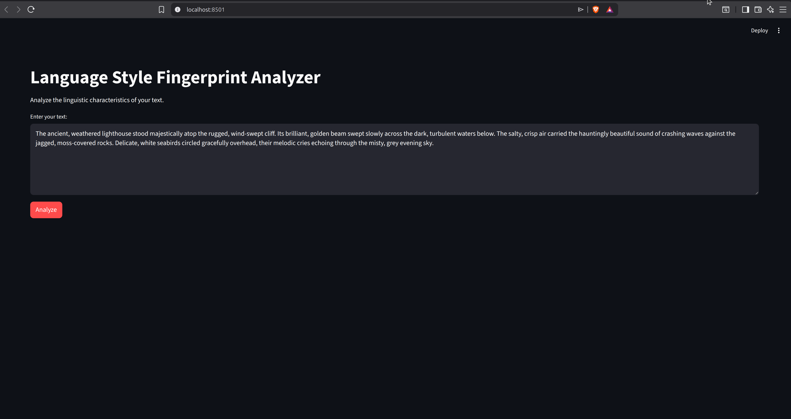
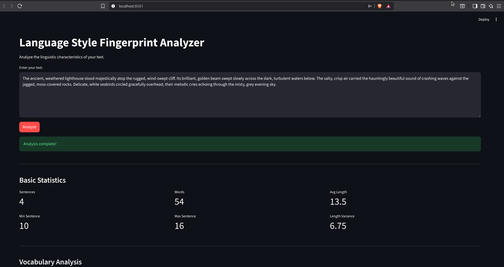
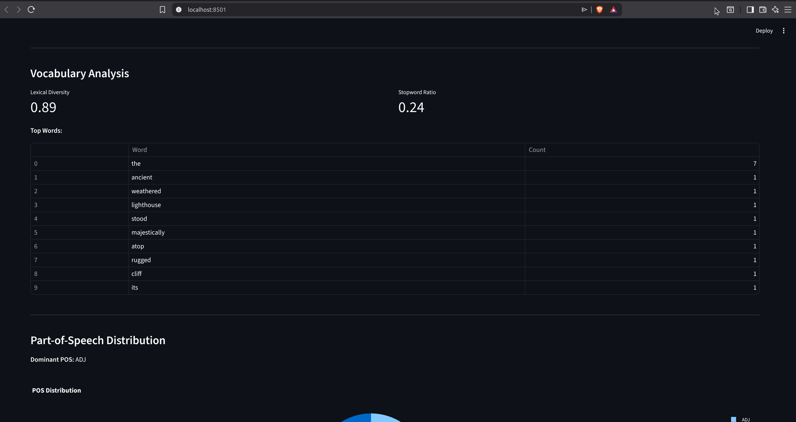
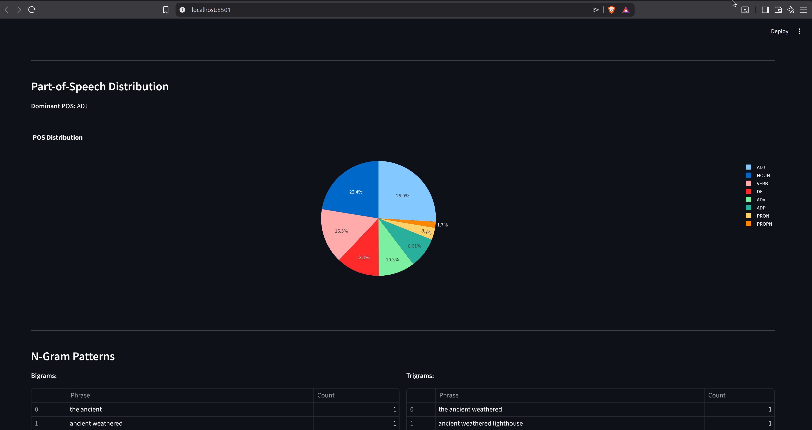
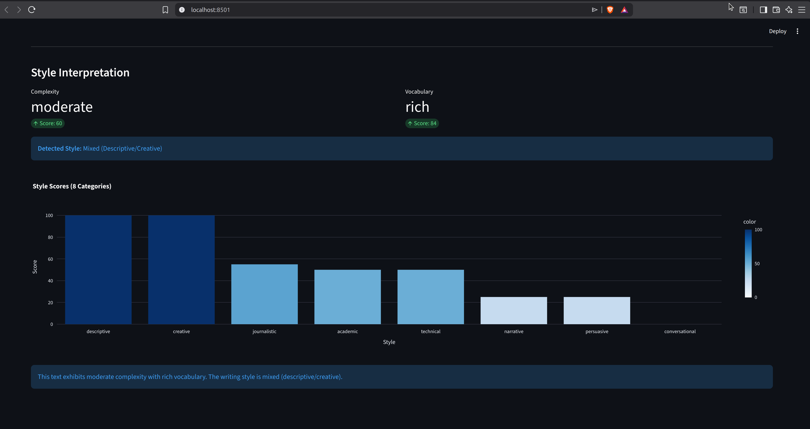
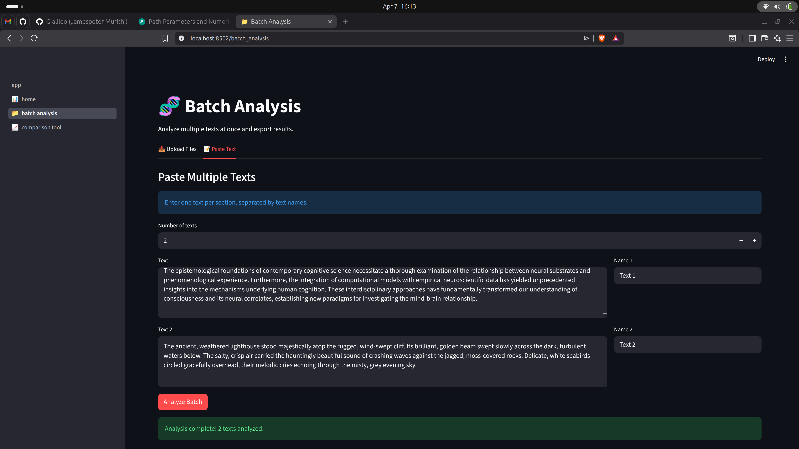
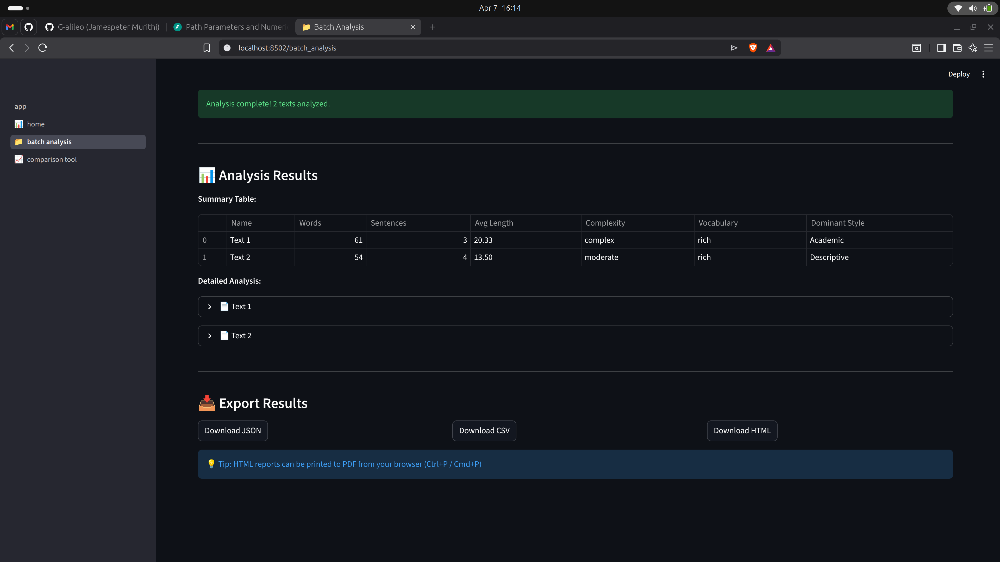
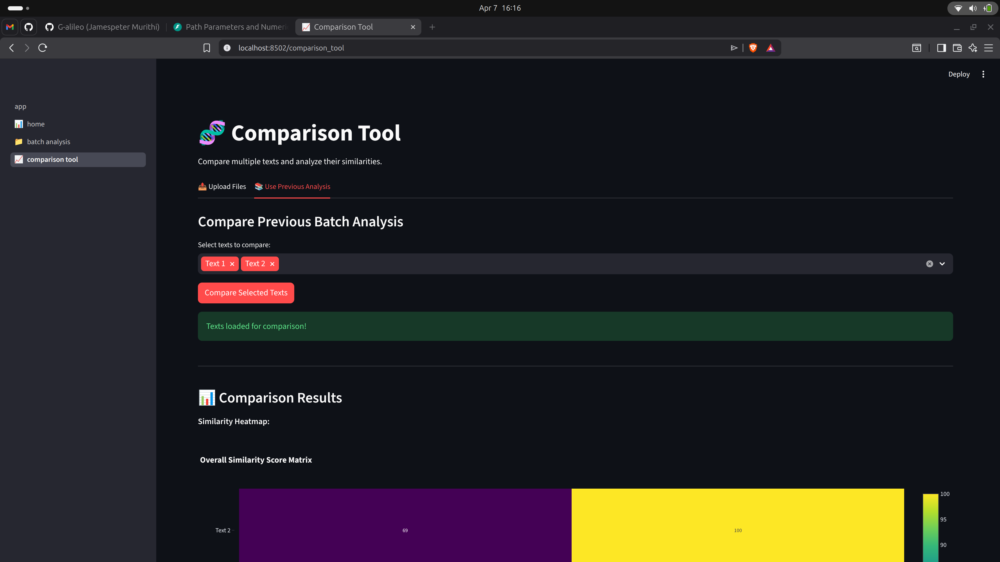
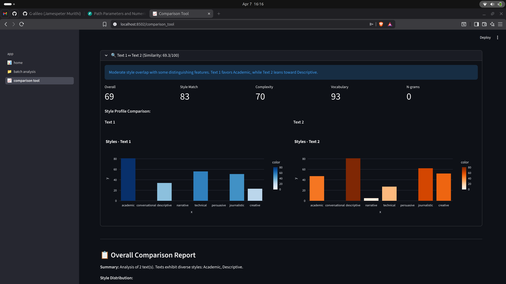

# Language Style Fingerprint Analyzer

A Natural Language Processing tool that analyzes written text and generates a linguistic fingerprint by extracting measurable stylistic features. Analyze single texts, batch process multiple files, and compare writing styles side-by-side.

## Problem Statement

There is a lack of simple tools that automatically analyze and quantify the stylistic characteristics of written text. This system applies NLP techniques to automatically extract stylistic features from text and generate a measurable linguistic profile, enabling researchers, writers, and educators to objectively evaluate writing complexity and linguistic patterns.

## Core Features

- **Single Text Analysis** - Extract comprehensive linguistic profile from any text
- **Batch Processing** - Analyze multiple texts simultaneously and export results
- **Style Comparison** - Compare 2+ texts side-by-side with similarity scoring and heatmaps
- **Multiple Export Formats** - Download results as JSON, CSV, or interactive HTML reports

### Analysis Capabilities

**Linguistic Metrics:**
- Basic statistics (sentence/word count, sentence length variance)
- Vocabulary analysis (lexical diversity, stopword ratio, top words)
- Part-of-speech distribution with visualization
- N-gram patterns (bigrams, trigrams)

**Writing Style Classification (8 Categories):**
Academic | Conversational | Descriptive | Narrative | Technical | Persuasive | Journalistic | Creative

**Advanced Features:**
- Automatic complexity rating (Simple/Moderate/Complex)
- Vocabulary assessment (Limited/Moderate/Rich)
- Mixed and varied style detection
- Insufficient/low-confidence text handling

## Tech Stack

- **Python 3.11** - Core language
- **NLTK** - Tokenization, n-grams, stopwords
- **spaCy** - Part-of-speech tagging
- **Streamlit** - Web interface with multipage support
- **Plotly** - Interactive visualizations and heatmaps
- **NumPy** - Similarity computations
- **UV** - Package management

## Quick Start

### Installation

```bash
git clone <repository-url>
cd Language-Style-Analyser

uv venv
source .venv/bin/activate
uv sync

uv run python -c "import nltk; nltk.download('punkt'); nltk.download('punkt_tab'); nltk.download('stopwords')"
uv run python -m spacy download en_core_web_sm
```

### Run the Application

```bash
uv run streamlit run app.py
```

The app launches at `http://localhost:8501` with three pages accessible from the sidebar:

1. **Home** - Analyze a single text
2. **Batch Analysis** - Upload and analyze multiple texts
3. **Comparison Tool** - Compare texts and view similarity heatmap

---

## Usage Guide

### 1. Single Text Analysis (Home Page)

Enter or paste text to receive instant analysis with sentence/word statistics, vocabulary metrics, POS distribution, n-gram patterns, and style interpretation.

<table>
<tr>
<td width="48%">

<p><strong>Text Input:</strong> Paste or type your text</p>
</td>
<td width="48%">

<p><strong>Basic Metrics:</strong> Word count, avg sentence length, variance</p>
</td>
</tr>
</table>

<table>
<tr>
<td width="48%">

<p><strong>Vocabulary:</strong> Lexical diversity, stopword ratio, top words</p>
</td>
<td width="48%">

<p><strong>POS Analysis:</strong> Parts of speech distribution chart</p>
</td>
</tr>
</table>

<table>
<tr>
<td width="100%">

<p><strong>Style Interpretation:</strong> Complexity rating, vocabulary assessment, 8-category style scores with dominant style</p>
</td>
</tr>
</table>

---

### 2. Batch Processing (Batch Analysis Page)

Upload multiple `.txt` files or paste multiple texts to analyze them all at once.

**Features:**
- Progress tracking during analysis
- Summary table view (word count, complexity, dominant style)
- Individual expandable sections per text
- Export all results at once (JSON, CSV, HTML)

<table>
<tr>
<td width="48%">

<p><strong>Batch Upload:</strong> Upload multiple files or paste texts</p>
</td>
<td width="48%">

<p><strong>Results:</strong> Summary table and per-text expandable sections</p>
</td>
</tr>
</table>

---

### 3. Style Comparison (Comparison Tool Page)

Upload or select 2+ texts to compare their writing styles.

**Outputs:**
- Overall similarity score (0-100)
- **Similarity heatmap** - Visual matrix showing pairwise style similarity
- **Side-by-side metrics** - Direct comparison of key statistics
- **Comparison report** - Common patterns, distinguishing features, style diversity
- **AI recommendation** - Rule-based explanation of similarities and differences

<table>
<tr>
<td width="48%">

<p><strong>Comparison Setup:</strong> Select 2+ texts to compare</p>
</td>
<td width="48%">

<p><strong>Heatmap & Insights:</strong> Similarity matrix and detailed analysis</p>
</td>
</tr>
</table>

---

## Export Options

All analysis results can be exported in multiple formats:

| Format | Best For | Contents |
|--------|----------|----------|
| **JSON** | Data processing, integrations | Complete fingerprint data |
| **CSV** | Spreadsheets, bulk analysis | Summary metrics + style scores |
| **HTML** | Reports, sharing | Interactive visualizations, heatmaps |

## Project Structure

```
┌─────────────────────────────────────────────────────────────────┐
│          🧬 Language Style Fingerprint Analyzer                  │
└─────────────────────────────────────────────────────────────────┘
                              │
            ┌─────────────────┼─────────────────┐
            │                 │                 │
      🎯 INTERFACE      🔧 ANALYSIS ENGINE    🛠️ UTILITIES
            │                 │                 │
        ╔═══════╗      ╔════════════════╗   ╔════════════╗
        ║ PAGES ║      ║ CORE MODULES   ║   ║ HELPERS    ║
        ╚═══════╝      ╚════════════════╝   ╚════════════╝
            │                 │                 │
            ├─ 📊 home.py    ├─ tokeniser.py  ├─ text_cleaner.py
            │                ├─ vocabulary.py ├─ export_formatter.py
            ├─ 📁 batch      ├─ pos_analyser  └─ comparison_gen.py
            │   _analysis.py ├─ ngram_analyser
            │                ├─ style_interp
            └─ 📈 comparison ├─ batch_processor
              _tool.py       └─ similarity_scorer
                 │              │
            app.py ◄────────────┘
         (multipage config)

                      📦 ASSETS & DOCS
                      │
                      ├─  images/
                      ├─  README.md
                      ├─  TEST_CASES.md
                      └─   pyproject.toml
```

**Layer Breakdown:**

- **🎯 Interface (pages/)** - User-facing Streamlit pages
- **🔧 Analysis Engine (core/)** - NLP processing and feature extraction
- **🛠️ Utilities (utilities/)** - Data formatting and report generation
- **📦 Assets** - Images, documentation, and configuration

## How It Works

### Style Scoring Algorithm

Each text is scored across 8 writing styles using a weighted combination of:
- **Sentence metrics** - Average length, variance
- **Vocabulary metrics** - Lexical diversity, stopword ratio
- **POS distribution** - Noun, verb, adjective, pronoun percentages

Scores are independent (0-100 each) and normalized. The system identifies:
- **Single dominant style** if one clearly leads
- **Mixed styles** if 2 styles score similarly (within margin)
- **Varied styles** if 3+ styles score within threshold
- **Indeterminate** if no style reaches minimum threshold

### Similarity Computation

When comparing texts, similarity is calculated using:
- **Style Similarity (40%)** - Cosine distance on 8-element style vector
- **Complexity Match (25%)** - Difference in complexity ratings
- **Vocabulary Match (20%)** - Difference in lexical diversity
- **N-gram Overlap (15%)** - Jaccard similarity on common bigrams

Result: 0-100 score where 100 = identical writing profiles.

## Test Cases & Examples

See [TEST_CASES.md](TEST_CASES.md) for 30+ example texts demonstrating:
- All 8 writing styles
- Mixed style combinations
- Edge cases (insufficient text, low confidence)
- Various genres (academic, legal, medical, creative, etc.)

## Limitations & Notes

- **Minimum text**: 10 words required; 10-30 words show low-confidence warning
- **Language**: English only (uses `en_core_web_sm`)
- **Batch size**: Comparing >15 texts simultaneously may be slow (O(N²) complexity)
- **PDF export**: Not included in Phase 1; export HTML and print-to-PDF from browser instead

## License

MIT License - See [LICENSE](LICENSE) for details.

## Author

Jamespeter Murithi
